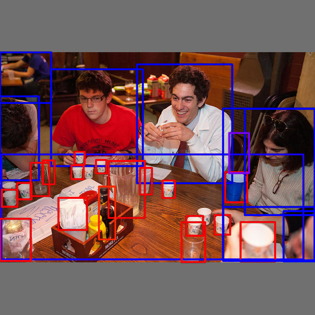

# yolo-rust-ort
A Rust implementation of YOLO using ONNX Runtime (ort)



## Overview
This small example demonstrates how to implement Ultralytics YOLOv8/YOLOv10 object detection in Rust using [ort](https://github.com/pykeio/ort) crate as a backend for running ONNX models. `ort` is a wrapper around [ONNX Runtime](https://onnxruntime.ai/).

## Getting Started

### Prerequisites
Ensure you have a basic Rust development environment set up. If you want to download a specific YOLO model, you'll also need Python with the `ultralytics` package installed. Note that it only supports `yolov8` and `yolov10` models.

### Running the demo
1. **(Optional) Download the YOLO Model**  
   To download a specific YOLOv10 model, use the following command:
   ```bash
   python ./download_model.py --model yolov10n.pt
   ```
   Alternatively, you can use the pre-included model at ./onnx/yolov10n.pt.

2. **Run the Rust Application**
```bash
cargo run -- path/to/your/image.jpg path/to/your/model.onnx model_name use_nms
```
For example, to run inference of a YOLOv8 model, run the command:

```bash
cargo run -- ./sample/people0.jpg  onnx/yolov8n.onnx yolov8 true
```
NMS is disabled by default. However, you can explicitly enable it by passing a boolean flag. YOLOv10 model doesn't need nms, so you can set it to `false` for YOLOv10 and `true` for YOLOv8

3. **Check the output**
The processed image and its corresponding detection results will be saved in the ./output directory. The output will include:
- A JPEG image with bounding boxes drawn with colors according to the class IDs.
- A text file containing the detection results in COCO format.

### Requirements
`raqote` requires some packages installed in the system, and in case of a Linux system, you should have `fontconfig` (`libfontconfig1-dev` for Ubuntu, and `fontconfig-devel` for Fedora) and `pkg-config` packages installed.

## Disclaimer
This project is my first attempt at Rust, so the code can be really messy.

## References
[ort](https://github.com/pykeio/ort)

[ultralytics](https://github.com/ultralytics/ultralytics)

[THU-MIG](https://github.com/THU-MIG/yolov10)
